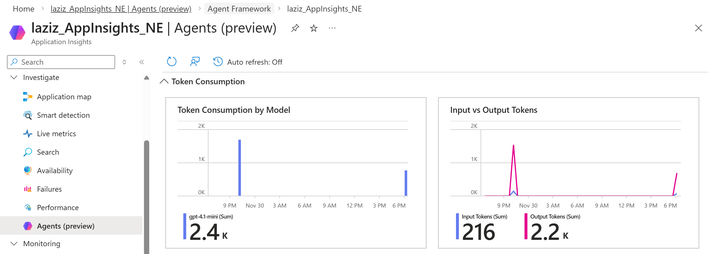
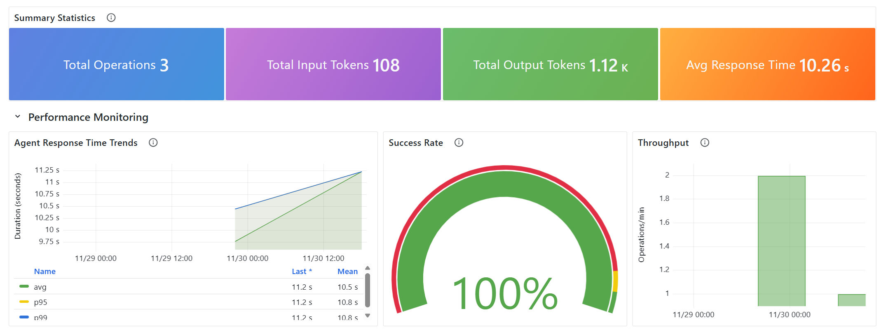

# Microsoft Agent Framework: Jupyter Notebooks for Ramp-Up Learning Process
**Microsoft Agent Framework** is an open-source development kit for building _AI agents_ and _multi-agent workflows_. It combines and extends constructs and concepts from two other Microsoft agentic frameworks: _Semantic Kernel_ and _AutoGen_.

This repo provides Jupyter notebooks to ramp up (Level 200: Agents V2) and build practical knowledge of Microsoft Agent Framework's _Python SDK_.

> [!WARNING]
> To successfully run these notebooks, you must have an **Azure AI Foundry** project and **AI model deployment**. Please ensure you have the following environment variables set up in your system:
> | Environment Variable             | Description                                                                     |
> | -------------------------------- | ------------------------------------------------------------------------------- |
> | `AZURE_FOUNDRY_PROJECT_ENDPOINT` | The endpoint URL for your Azure AI Foundry project.                             |
> | `AZURE_FOUNDRY_GPT_MODEL`        | The name of the model deployment to be used by the agent, e.g., _gpt-4.1-mini_. |

## 📑 Table of Contents
- [Notebook 0: Quick Start](#notebook-0-quick-start)
- [Notebook 1: Agents - Tools](#notebook-1-agents---tools)
- [Notebook 2: Agents - Middleware](#notebook-2-agents---middleware)
- [Notebook 3: Agents - Observability](#notebook-3-agents---observability)
- [Notebook 4: Agents - Memory]()

## Notebook 0: Quick Start
This notebook, `AF_00_GettingStarted_QuickStart.ipynb`, provides a general intro to the Agentic Framework. It covers the core steps required to get a basic agent running.

- Configure your environment and set up necessary imports, incl. suppressing user warnings from `agent_framework_azure` Python package:

``` Python
# Import required packages
import os
import asyncio
from agent_framework import ChatAgent
from agent_framework.azure import AzureAIClient
from azure.identity.aio import DefaultAzureCredential

import warnings
warnings.filterwarnings(
    action = "ignore",
    category = UserWarning,
    module = "agent_framework_azure"
)
```

- Create an **AI Client** using _AzureAIClient_ to connect to your Azure AI Foundry project:

``` Python
ai_client = AzureAIClient(
    agent_name = "Azure-AI-Agentic-Client",
    project_endpoint = PROJECT_ENDPOINT,
    model_deployment_name = MODEL_DEPLOYMENT,
    async_credential = DefaultAzureCredential()
)
```

- Instantiate a basic **Chat Agent** using the _ChatAgent_ class:

``` Python
agent = ChatAgent(
    chat_client = ai_client,
    name = "Haiku-Poet-Agent",
    instructions = "You are a haiku poet. Respond to user queries with a haiku."
)
```

- Run the agent using both **non-streaming** _agent.run(prompt)_ and **streaming** _agent.run_stream(prompt)_ methods to test its response capabilities.

``` Python
response = await agent.run(prompt)
...
async for streaming_update in agent_alt.run_stream(prompt_alt):
    if streaming_update.text:
        print(streaming_update.text, end="", flush=True)
```

The code creates a _Haiku Poet Agent_ that responds to user queries with a haiku:

``` JSON
User: What is life?

Agent: River's gentle flow,  
Moments dance in fleeting light,  
Life blooms, then fades soft.
```

## Notebook 1: Agents - Tools
This notebook, `AF_01_Agents_Tools_MCP.ipynb`, demonstrates how to integrate _tools_ with your AI agent, specifically focusing on a **Hosted MCP (Model Context Protocol) Tool**. Tools allow your agents to access external information and perform actions.

You will learn how to:
- Define a Hosted MCP Tool by providing a _name_, _URL_ and setting the _approval_mode_ (e.g., "**never_require**").

``` Python
mcp_doc_tool = HostedMCPTool(
    name = "Microsoft-Learn-MCP-Tool",
    url = "https://learn.microsoft.com/api/mcp",
    approval_mode = "never_require"
)
```

- Create an AI Agent and equip it with the defined tool by passing a list of tools to the _ai_client.create_agent()_ method.

``` Python
agent = ai_client.create_agent(
    name = "Microsoft-Documentation-Agent",
    instructions = "You are an agent, which can use its MCP documentation tool to answer end user questions about Microsoft products. Limit your response to 2 paragraphs.",
    tools = [mcp_doc_tool]
)
```

- Run the tool-equipped agent to answer a product-specific question, using the external resource for a grounded answer.

``` JSON
User:
How can I create a new Azure AI Foundry resource?

Agent:
To create a new Azure AI Foundry resource, you can use the Azure portal by following these steps: Go to the AI Foundry resource creation page in the Azure portal at https://portal.azure.com/#create/Microsoft.CognitiveServicesAIFoundry.
```

## Notebook 2: Agents - Middleware
This notebook, `AF_02_Agents_Middleware.ipynb`, shows how to implement **agent middleware** to intercept and modify agent responses. Middleware provides a powerful way to enable content moderation, logging and result transformation without modifying core agent logic.

You will learn how to:
- Define **agent middleware** with the `@agent_middleware` decorator for a function that moderates agent outputs:

``` Python
@agent_middleware
async def moderator_middleware(context, next):
    """Agent middleware that moderates output by replacing 'badword' with '***'."""
    print("Moderator: Starting agent run...")
    
    await next(context)
    
    if context.result is not None:
        # Create moderated messages and replace inappropriate content
        ...
```

- Attach middleware to an agent through the `middleware` parameter:

``` Python
agent = ai_client.create_agent(
    name = "Storyteller-Agent",
    instructions = "You are a creative storyteller. Limit your responses to 1 paragraph.",
    middleware = [moderator_middleware]
)
```

- Verify that middleware intercepts agent execution, scans output for inappropriate content and automatically replaces it before the response is shared with the user.

``` JSON
User:
Please, tell me a story about red panda.

Moderator: Starting agent run...
Moderator: Scanning agent output...
Moderator: Replaced 2 occurrence(s) of inappropriate content
Moderator: Moderation complete

Agent:
In the lush bamboo forests of the Himalayas lived a curious red panda named Riku who often found himself in sticky situations... [content with replaced words]
```

## Notebook 3: Agents - Observability
This notebook, `AF_03_Agents_Observability.ipynb`, explains how to enable **Open Telemetry** on an AI Foundry agent, so that any interactions are automatically logged and can be viewed in the connected _Azure Application Insights_ resource.

- Ensure that you install the required `azure-monitor-opentelemetry-exporter` Python package:

``` PowerShell
pip install azure-monitor-opentelemetry-exporter
```

- Open Telemetry can be auto-enabled through AI Foundry's connected App Insights resource by calling the following asynchronous function of the _AzureAIAgent_ class:

``` Python
await ai_client.setup_azure_ai_observability()
```

- You can now visualise the collected traces in Azure Monitor, by using the **Investigate -> Agents** menu section in Azure App Insights: 


- Alternatively, these traces can be visualised in a built-in Graphana dashboard as shown below:


## Notebook 4: Agents - Memory
This notebook, `AF_04_Agents_Memory.ipynb`, demonstrates how to achieve persistence in agent conversations by using thread _serialisation_ and _deserialisation_. The scenario simulates a hotel concierge agent that checks in a guest, loses its in-memory state and then recovers the conversation context to process a room service request.

You will learn how to:
- Create a new thread for a conversation:

``` Python
guest_thread = agent.get_new_thread()
```

- Serialise the thread state to save it to persistent storage (e.g., a JSON file) after the first interaction:

``` Python
serialised_thread_data = await guest_thread.serialize()

# Save to file
with open(FILE_NAME, "w") as f:
    json.dump(serialised_thread_data, f, indent=4)
```

- Deserialise the thread state after the application restart to restore the conversation history into a new agent instance:

``` Python
# Load from file
with open(FILE_NAME, "r") as f:
    thread_data_reloaded = json.load(f)
    
restored_thread = await agent_new.deserialize_thread(thread_data_reloaded)
```

The whole conversation, including the app restart, may look like this:
``` JSON
User (Check-in):
Hello, my name is Alex Reed and I am checking into room 1205.

Agent:
Welcome, Alex Reed! I have you checked into room 1205. If you need any assistance during your stay, feel free to ask. How can I help you today?

... (Application Restart/Memory Cleared) ...

User (Room Service):
I would like to order room service: a club sandwich and a pot of tea.

Agent:
Certainly, Alex! I’ll place an order for a club sandwich and a pot of tea to be delivered to room 1205. Is there any particular time you would like this to be served?
```
